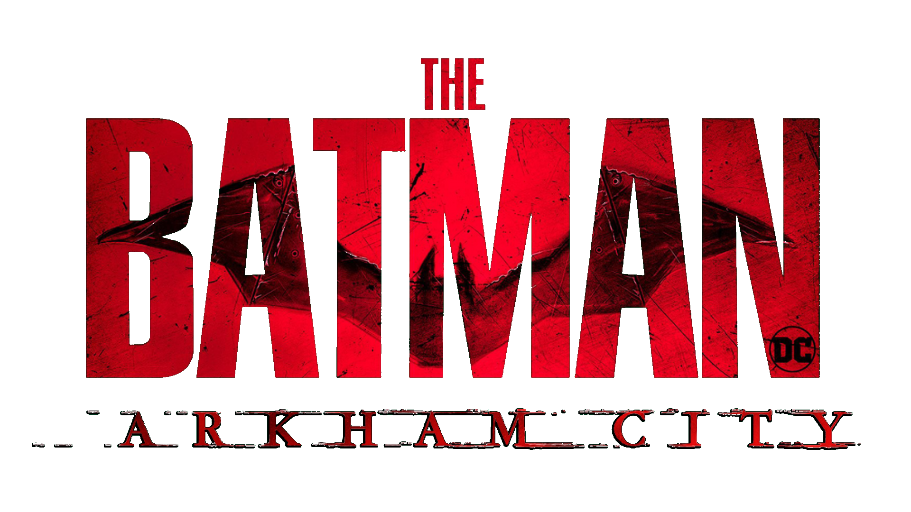
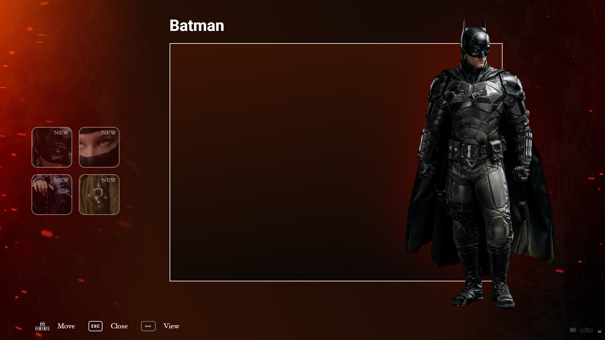
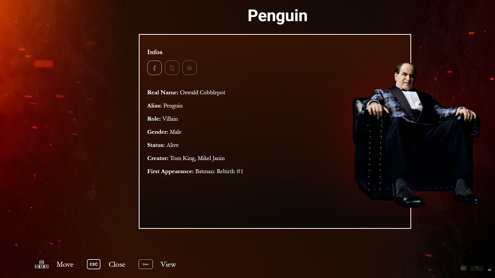
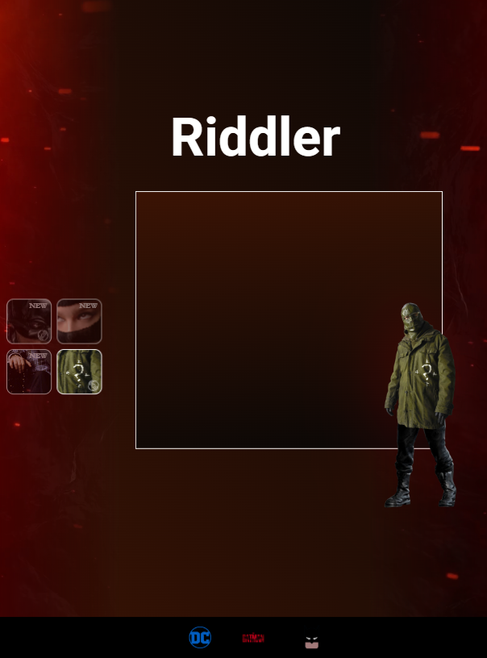
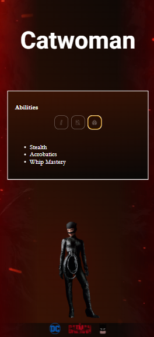

# Arkham Encontra a Vingança

Lançada em 2008, a franquia de jogos Arkham inspirou diversas outras mídias, como jogos, filmes e outras histórias como, por exemplo, *The Batman*, até certo ponto. Não é de se surpreender, já que o segundo jogo, intitulado *Batman: Arkham City*, recebeu o prêmio de Melhor Jogo de Ação em 2012 pela VGA.

Um dos elementos clássicos da saga é sua interface distinta, entre eles o sistema de biografias dos personagens. O intuito desse recurso é explicar e detalhar informações dos personagens que Batman ou seus aliados encontram durante a história, facilitando a compreensão do jogador sobre quem são essas figuras.

Com o sucesso do filme *The Batman*, a série do *Pinguim*, e com *The Batman – Parte II* chegando aos cinemas, seria interessante imaginar como seria a tela de biografia do jogo *Batman: Arkham City*, adaptada para os personagens e o visual da chamada “A Saga The Batman”.

# Arkham Meets Vengeance

Released in 2008, the *Arkham* game franchise has inspired various other media, such as games, films, and stories for example, *The Batman*, to some extent. It's no surprise, considering the second game, titled *Batman: Arkham City*, won the award for Best Action Game in 2012.

One of the classic elements of the saga is its distinct interface, including the character biography screen. The purpose of this feature is to explain and provide details about characters that Batman or his allies encounter throughout the story, helping players understand who they are without much difficulty.

With the success of *The Batman* film, the *Penguin* series, and *The Batman – Part II* set to hit theaters, it’s interesting to imagine how the biography screen from *Batman: Arkham City* would look if adapted to the characters and design of the so-called "The Batman Saga".

| 
Desktop
 |
|:--:|
|  |

---

  
  
  

---

# 🔍 Como buscar as informações?

Para obter as informações, foi usada uma API chamada **Batman API**.

Ela fornece praticamente todos os dados que aparecem no painel de biografia de todos os personagens disponíveis.

Como o projeto exige detalhes como "Primeira Aparição" e "Habilidades" para retratar a obra original, essa API foi necessária.

Levando em conta que, no jogo, o Batman busca essas informações via banco de dados, faz sentido também chamar uma API para receber dados externos.

**Detalhe 1:** O nome verdadeiro do Charada no filme é Edward Nashton, porém a API utiliza seu nome original, Edward Nigma.

**Detalhe 2:** Similar ao problema do nome do Charada, a API retrata as armas de guarda-chuva do Pinguim original em alguns tópicos.

**Detalhe 3:** Para fazer jus à nomenclatura do próprio Batman, não seria interessante chamar essa API de BatApi? (Brincadeira)

Link para a API: https://batmanapi.com/

# 🔍 How to fetch the information?

To retrieve the data, an API called **Batman API** was used.

It provides almost all the information shown on the biography panel of all available characters.

Since the project requires details like "First Appearance" and "Abilities" to accurately portray the source material, this API was necessary.

Considering that in the game Batman pulls this data from a database, it makes sense to also call an API to receive external information.

**Detail 1:** The real name of the Riddler in the movie is Edward Nashton, but the API uses his original name, Edward Nigma.

**Detail 2:** Similar to the issue with the Riddler’s name, the API reflects the original Penguin’s umbrella weapons in some topics.

**Detail 3:** To honor Batman’s own naming style, wouldn’t it be interesting to call this API BatApi? (Just Kidding)

Link to the API: https://batmanapi.com/

